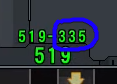
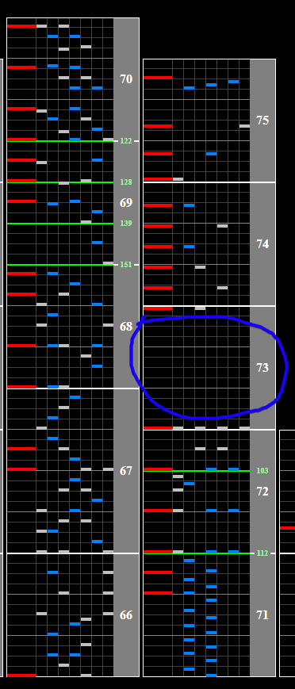

# Concertino in Blue

## Chart Preview

Chart played by 페새도끼

## ★☆☆☆☆ Set for 155BPM max (optional Gear Shift)

The song starts at 140BPM, raises to 155BPM and drops back down at the end of the song. You can get around this by just setting the songs minimum GN to your regular GN.

 (image from another chart, concept still the same)

There is a gap at the end where you can gear shift up by 1 if you really struggle with reading slow, but honestly it isn't necessary.

