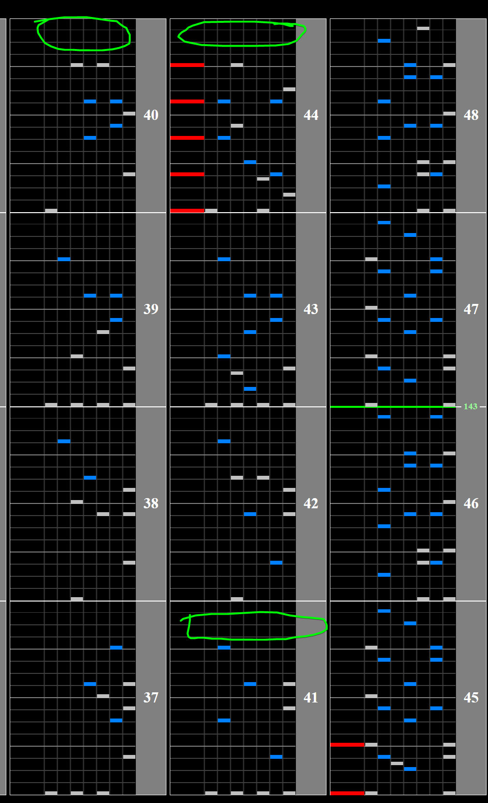

# 2hot2eat

## Chart Preview

Chart played by GOLD CS Autoplay, uploaded by Ko Ramdeo

## ★☆☆☆☆ Method 1: Shift GN a bit or read fast

If you're comfortable reading ~11% faster than normal for 20 seconds, you can easily no tech this.

Optionally, you can choose to set your GN a bit higher so that the first (easy) half is slower than normal but the speedup is easier.

## ★★☆☆☆ Method 2: Use regular hi-speed

While a gear shift with floating hi-speed affects your hi-speed by 0.5x, a gear shift in regular hi-speed is a lot smaller. We can use this to our advantage.

1. Switch to regular hi-speed by holding start and pressing effect
2. Adjust your lane cover and green number as close to your regular numbers as you can
3. Gear shift down by one like normal before the speedup. Good places are shown below.

This method saves you reading at an off speed bar the ending.

You can gear shift anywhere before the chart speeds up, but note that the easy windows disappear once you're into the chorus.

