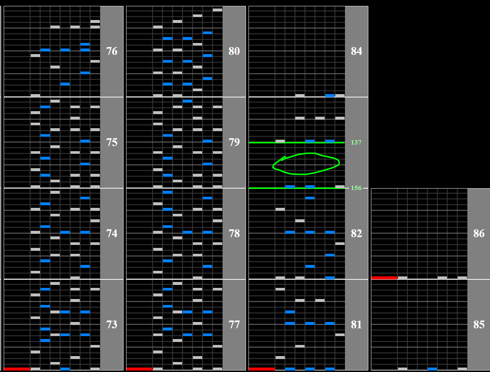

# Blind Justice ~Torn souls, Hurt Faiths~

## Chart Preview
Chart played by GOLD CS Autoplay, uploaded by Ko Ramdeo

 Autoplay")

## No tech required (optional gear shift)

Blind Justice just features a mild slowdown at the end. With only 6 chords to hit  soflan tech isn't really necessary, but that being said you can gear shift up by 1 between the first 2 chords (circled in green).

