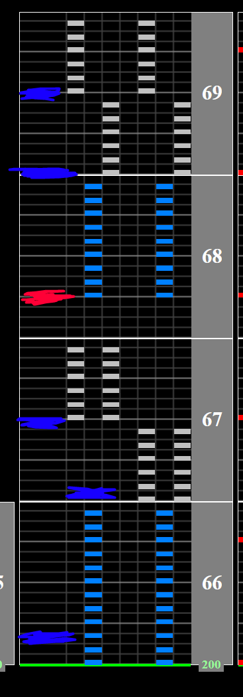
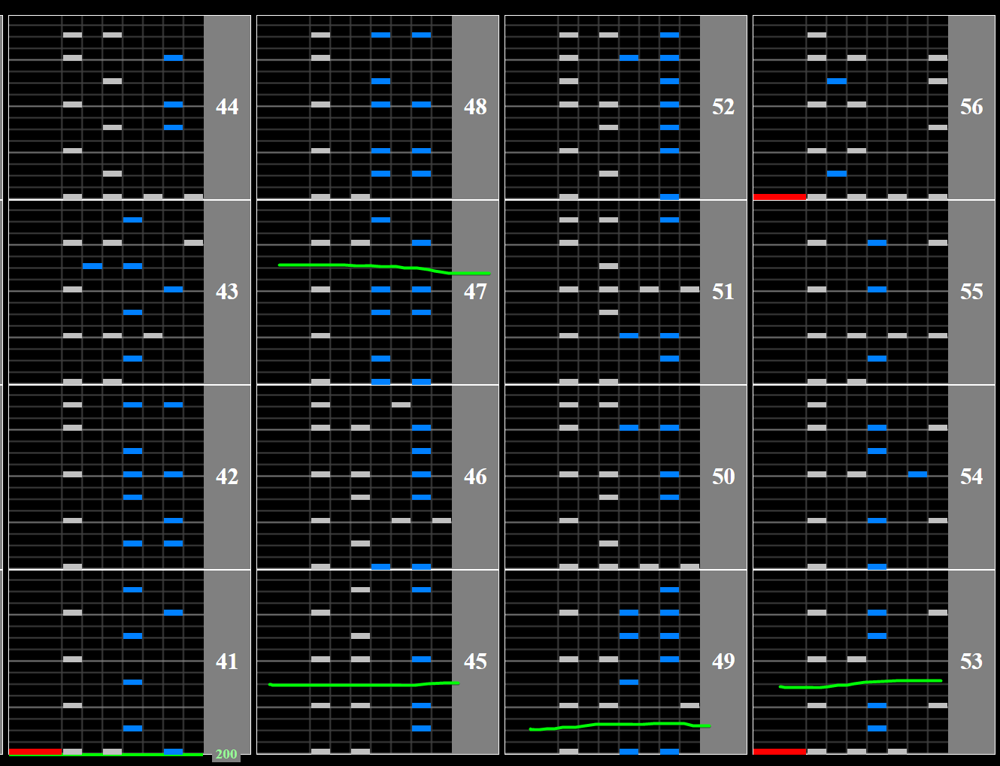

# Fascination MAXX

## Chart Preview

Chart played by DOLCE.

what can i say its the funny chart lmao

nonran/mirror very helpful and consistent

 MAX-44 全国トップ / played by DOLCE. / beatmania IIDX27 HEROIC VERSE")

## A preface about the jacks

If you're playing for normal clear, you can basically ignore the jacks since you can easily climb after them anyway with some practice.

However, if you plan on playing for hard clear, a common strategy during the jack section is to break form and alternate your hands. If you're going to do this make sure that you **alternate the hand you start each jack section with**. This way, whenever the columns of the jacks change it's always starting on the same hand.

Let blue denote your dominant hand and red denote your non dominant hand.

If you were to start that 4th jack section with your dominant hand, you'd have to start the last 2 on your non dominant hand.

## A preface about the stops

If you're comfortable with simultaneously counting while playing FAXX and not the greatest at keeping track of the stops, you can count before the stops to make sure you stop at the right time.

How I count personally is by using **16-12-17**. This means that you hit 16 chords THEN hit the stop, 12 chords THEN hit the stop and 17 chords THEN hit the stop.
In your head it should sound something like

1-2-3-4- 1-2-3-4- 1-2-3-4- 1-2-3-4- **STOP**  
1-2-3-4- 1-2-3-4- 1-2-3-4- **STOP**  
1-2-3-4- 1-2-3-4- 1-2-3-4-5- **STOP**

Everyone will have their own counting method, this is just my example. On with the tech.

## ★★★★★ Method 1: DOLCE. half lane cover regular hi-speed strategy

What DOLCE. does utilises the fact that turning the lane cover back on when using regular hi-speed doesn't float. This means that if you adjust your GN to be double when the lane cover is halfway down your screen at the beginning, that if you turn the lane cover off you'll be at normal GN for the 400BPM section.

If that's confusing, here are some steps/a timeline of the chart. If you can't read without a lane cover, you may need to use lift to make the chart more readable.  
If this strategy confuses you, take a look at how DOLCE. applies it in the chart preview.

Slow reading is required as well as memorisation.

1. Switch to regular hi-speed using start and effect
2. Put your sudden+ so that it covers half of the lane
3. Gear shift your GN to be double what it normally is
4. Turn off the lane cover
5. Read the beginning slow and hit the stops
6. After the final stop there is a 100BPM section. This will be the same 4 notes repeated with a trill at the very end, so even if you cant read at 25% speed, try to time the repeating notes. On nonran this is 7643, and can be comfortably 1handed
7. Read the 200BPM section slow for a bit, and turn your lane cover back on at the earliest gap you can find. If you practice this enough, you can turn the lane cover on without breaking combo (anywhere marked in green below)
8. Turn the lane cover back off in the break before the jacks
9. Hit the final slow section. There aren't many notes, so just do your best to hold gauge

## ★☆☆☆☆ Method 2: Float it

Just float it whenever it changes. Try to float as little as possible if you do.
Gear shifting down a couple times right before the jacks in substitution for a float is heavily recommended however.
