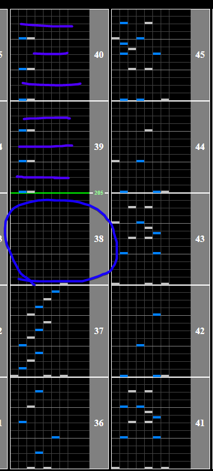
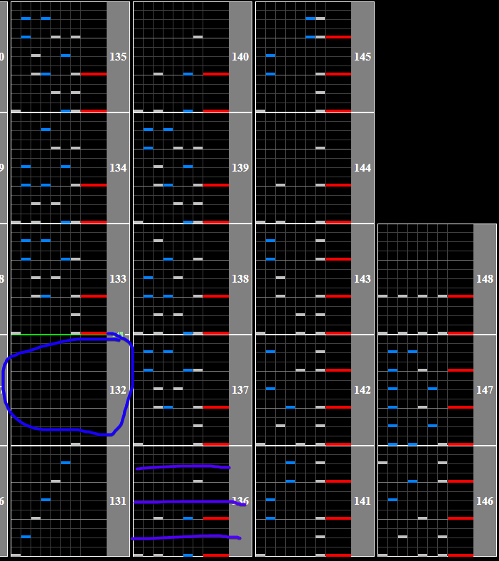

# Marie Antoinette

## Chart Preview

Chart played by Empress CS Autoplay, uploaded by hl1auz

 Autoplay")

## ★★★☆☆ Method 1: FHS off + gear shifts (Toby strategy)

**_Use [regular hi-speed](../../reg_hs.md) for this strategy, NOT FLOATING HI-SPEED!_**

Marie Antoinette goes from 215BPM -> 205BPM -> 248BPM.

1. Before the **first BPM change** (215 -> 205), **gear shift up by one** tick (circled in blue below)
2. Before the **second BPM change** (205 -> 248), **gear shift down by two** ticks (circled second in blue below)
3. (optional) Tweak your lane cover so the final green number is closer

This method is very effective if your numbers work out, but can be less consistent than using something like a [LIFT Substitute](../../tech\LIFTSub.md).

## ★★★★☆ Method 2: Double lane cover removal

Make sure to use regular hi-speed for this strategy, as disabling your lane cover in recent styles floats. It is also recommended to use a [LIFT Substitute](../../tech\LIFTSub.md).

The first change is towards the beginning, and can be (but doesn't need to be) mitigated by moving your lane cover a small amount in the circled gap.

Optimal lane cover is 173WN (or 173 / 1000 \* LIFT). For the ending speedup section there is a similar large gap where you can turn off your lane cover. Simply turn off your lane cover, and the chart will be scrolling at the correct speed.

## ★★☆☆☆ Method 3: Gear Shift

Depending on your Green Number, you might be able to just shift down 1 or 2 in the blue circle in the image above to cover the speedup. If you can do this it is way easier and more consistent, but this method in itself doesn't cover as wide of a range of Green Numbers and will likely require you to fiddle with your lane cover to find a comfortable shift.

## ★☆☆☆☆ Method 4: Float

If neither Method 1 or 2 work for you, you can just float the chart once you reach the speedup. It's relatively safe, even for holding a hard clear. Similar to Method 1, the initial float is optional.

Float right on the green line (BPM change)
