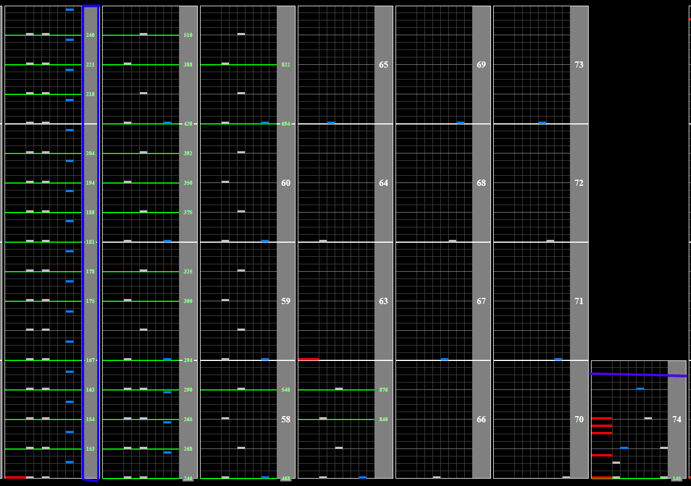
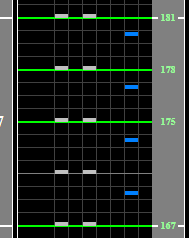
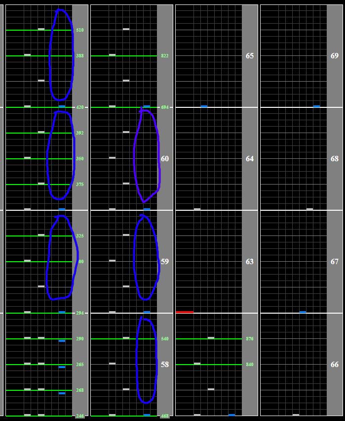
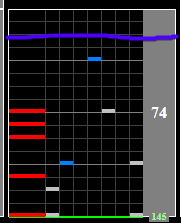

# Y&Co. is dead or alive

## Chart Preview
Chart played by DOLCE.

This, contesting with probably only op.31, is the holy grail of soflan charts.

 MAX-105 [2851] / played by DOLCE. / beatmania IIDX25 CANNON BALLERS")

## Method 1: 6 gear shift down + lane cover off + reading slow

(This tech is for lightning model cabs and home controllers. The start button is not in an easy position to abuse on old cabs. Method 2 is likely required if you are playing on an old cab)

Firstly, Method 1 requires that you play on non-ran (mirror for p2). If you can not hit non-ran patterns, and I don't mean less comfortable hitting them I mean that you literally can not hit them, consider learning the more difficult Method 2.

Position your right hand so it covers start and button 6. You'll notice from the image above that the patterns alternate between key 1+3 and key 6. Your aim is to gear shift down by **6** anywhere in this section.

The easiest way (in my opinion) to do this is to hold start and hit 9 times, using your right thumb to hit key 6.  
**(13 --> 6 --> 13 --> 6 --> 13 --> 6 --> 13 --> 6 --> 13)**

What this will do is shift you down by 10 (because of the 10 white key presses) and then shift you up by 4 (because of the 4 black key hits), leaving you at a net 6 down.

**BONUS:** Try and double tap start and hold it down on the second tap when you go for the gear shift chunk, before going for the chunk. This will turn your lane cover off before the gear shifts, and eliminate the need to turn it off later, and lets you focus all of the soflan down in a 2 second window.

If you don't do this, you'll want to turn off your lane cover during any of the sections where there is no note on 6 (your off hand will be free to hit start). The purple circle is a deadline cut off, because by that point the song has reached 540BPM and it is starting to get out of hand.

After the hyper fast section (1 2 3 4 5 6 7 6 5 4) the chart will slow down to be extremely slow because you have gear shifted it down by 6. You will need to read this slow.

After the final black note, turn your lane cover back on at the purple line for that sweet sweet auto float, and you are done. The rest of the chart should be at your regular Green Number. DOLCE. also turns the lane cover back on in the same spot in the chart preview video, so give that another watch if you're still not sure where this is.

(The purple line is also marked on the image at the top of this method)   

**GOLDEN RULE: DO NOT TOUCH THE CHART AT ALL DURING THE 822BPM SECTION!**

## Method 2: DOLCE.

Read Method 1 for context, as Method 1 is essentially just my easier take on DOLCE.'s method.

DOLCE.'s method is identical to Method 1, HOWEVER, you will need to adjust your speed changes depending on the random. This means holding start for white keys, and letting go for black keys **in between notes**.

This is best explained by DOLCE.'s incredible play (the linked chart preview). You will see his random gave him key2 + key4 then key1 (p1 equivalent key4 + key6 then key7). He only holds start while hitting key1, as this will shift him down, and needs to let go of start between the notes.

This means that Method 2 is extremely random dependent, basically requiring you to be able to hit the entire first half of the soflan section with 1 hand, as well as having a single impossible, but extremely unlikely (1/840) random (all 3 black keys).

Your aim is still to gear **shift down by 6**, lane cover off, lane cover back on after the song slows down again, so its definitely possible to transition from Method 1 to Method 2 after learning it.