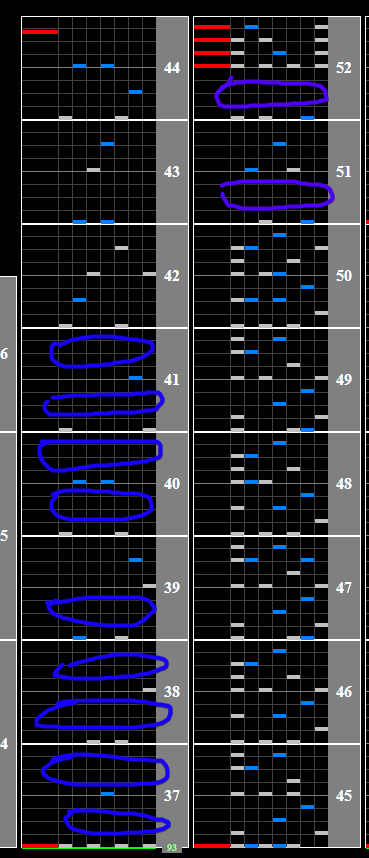
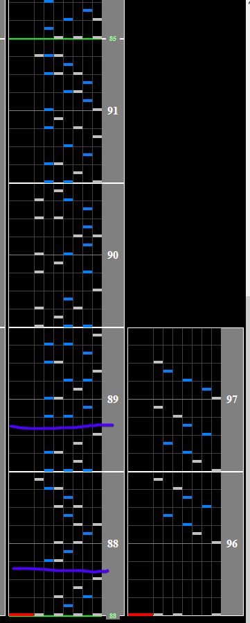

# 卑弥呼

Alternative titles: Himiko

## Chart Preview

Chart played by Empress CS Autoplay, uploaded by hl1auz

 Autoplay")

## ★★☆☆☆ Method 1: Gear shift (optional) + float at end

Himiko has 2 slowdowns, one in the middle with manageable density and one at the end with crippling density.

If you're struggling to read the first slowdown, the first half of it is very easy, giving you a lot of time to fit 2 or 3 gear shifts in there. There are 2 gaps before the chords where you can shift back down, as opposed to the 9 gaps at the beginning for shifting up. If you miss these, you can always float after the speedup, but mistakes like this are the reason I always opt for no tech on the first slowdown.

(Shift up at blue, shift back down at purple)

Himiko's second drop comes after the most dense part of the chart. If you can't follow this well, it can be tricky to follow when you should float.

-  If you have 0 slow reading ability, float right as the BPM changes and just tank it.
-  If you can hold your slow reading for a bit, hit one or two of the chunks before floating to keep your gauge a bit more stable and float at either of the 2 purple lines (gaps). If you miss both of these, your accuracy dropped from missing the float will be too much and you might as well try again if you're aiming for high accuracy.

## ★★★★☆ Method 2: No tech

If you can read both slowdowns, good god go for it. Good for clears, bad for timing.
