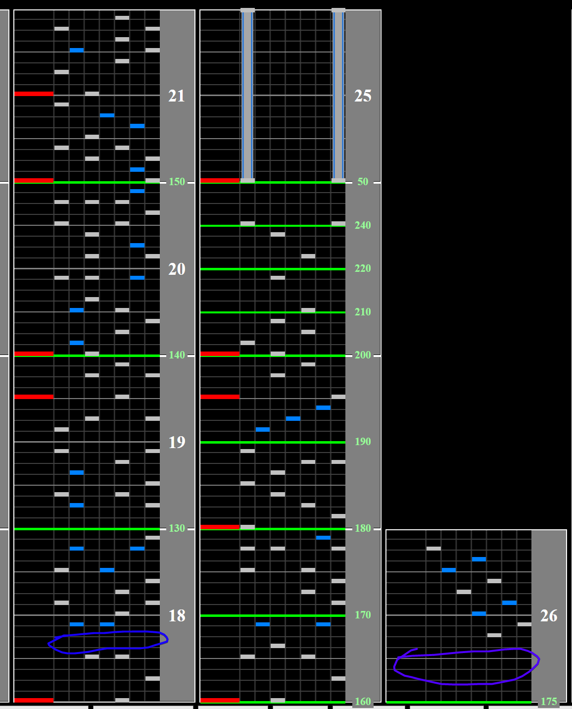

# D

## Chart Preview

Chart (convert) played by LR2 autoplay, uploaded by earthnoidx

## ★★★☆☆ Gear Shift + double float

D consists of a speedup, followed by a consistent 170BPM section, followed by a slowdown into a 120BPM section. With that being said, there are actually large gaps that you can float on before each consistent section, signified by the end of each CN.

For the speedup, there is a small gap **(circled in blue)** where you can fit a **gear shift down**. This allows you to read the beginning of the chart at a normal speed, while also having the speedup be manageable. The gap may seem small, but once you get a feel for where it is in the song you can consistently fit a gear shift in there.

Finally, after the CN section at the end of the speedup, you can float to restore your speed for the upcoming section (circled in purple). Repeat for the CNs at the ending. Keep in mind that on floating hi-speed, turning your lane cover on floats automatically for you.

**It is highly recommended to switch off your SUDDEN+ cover while holding the CNs and turn it back on after the CNs end to float.**

