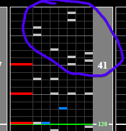

# New Castle Legions

This guide covers the NEW New Castle Legions charts added in rootage. While this tech may work on the old charts, nothing is guaranteed.

## Chart Preview

Chart played by IIDX MK

## ★★★★☆ Method 1: (Float OR read slow) + Gear Shift

Method 1 is simpler and lets you choose between reading slow at the beginning or dropping gauge for a float.

**Choose step 1 OR step 2. DO NOT DO BOTH!**

1. Set for 150 (set Base GN to 1.25 \* GN) and read the start slow
2. Read the beginning at normal speed and float once the song hits 150BPM
3. During the 120BPM slowdown, gear shift down by 1 or 2
4. The end of the chart should be at a readable speed. Be wary of the extra 10BPM speedup shortly after the initial one

The non-ran contains mostly white keys during the slowdown, making it helpful for a guaranteed easy gear shift.

## ★★★★★ Method 2: Read slow + Pre-Float

Method 2 is a lot more cumbersome and requires reading slow, however ensures that you have a perfect Green Number for the ending, which is the hardest section of the chart.

1. Prepare your Base GN for the pre-float later (set Base GN to 1.5 \* GN)
2. Gear Shift at the beginning of the chart to `1.25 * Regular GN`
3. Read the beginning 120BPM section slow
4. Read the 150BPM section at normal speed, the gear shift at the beginning of the chart covers this change for you
5. Float during the 120BPM slowdown. This will cover you for the rest of the chart.

## ★★★☆☆ Method 3: Read the whole thing slow

Set for 180 (set Base GN to `1.5 * Regular GN`) or if you can read a little fast set for 170 (set Base GN to `1.4167 * Regular GN` and just read the whole chart slow until the ending. Terrible for scoring, good for clearing if you can manage to read this slow.
