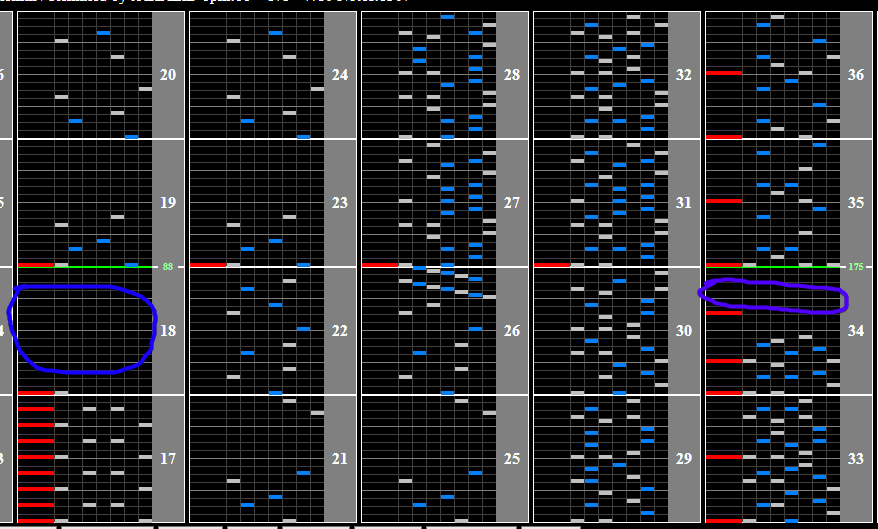

# ラクエン Feat.Chiharu Chonan -JAKA respect for K.S.K. Remix

Alternative titles: Rakuen Feat.Chiharu Chonan -JAKA respect for K.S.K. Remix

## Chart Preview
Chart played by DOLCE.

 MAX-31 / played by DOLCE. / beatmania IIDX INFINITAS")

## Gear Shift

This chart features a fairly dense half BPM section during the first half. Luckily, there is a fairly large gap in the beginning for you to fix your GN, and a large gap towards the end to slow it back down again.

Optimal hi-speed is one that you can double easily (ends in .00 or .50), so try and adjust your lane cover to find a value close to those.

Shift up at blue, shift down at purple by same amount. Shifting after the scratch is recommended so that you dont accidentally float.

