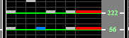
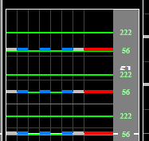
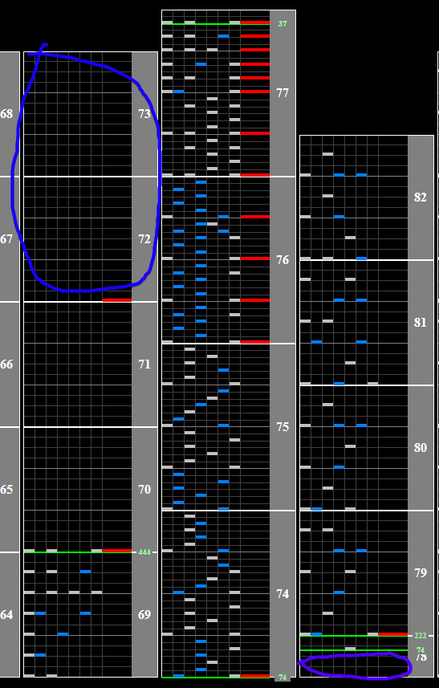

# SABER WING

## Chart Preview

Chart played by CHARM

 2841 MAX - 35")

## ★★★★☆ Gear shift + memorise

SABER WING has many stops in the beginning where the notes freeze for a second before coming down. The key thing to look for here is a chord with scratch, followed by another chord with scratch.

 

After these stops, there is a 444BPM section with a single scratch in it, followed by a slowdown back to 74BPM.

The strategy here is the to shift before the slowdown so that when it approaches you'll be at a normal hi-speed. Unfortunately, this means that you'll effectively be at around 64 GN before the notes approach and you're just about guaranteed to drop combo. **If you're aiming for FC, play on non-ran and literally memorise the first few notes of the slow section.**

**Gear shift up by about 4 or 5** during the 444BPM section (circled in blue), and shift back down the same amount in the gap afterwards (circled in purple).

The gap looks small, however the song is playing at 37BPM. You can see how big this gap is and how to fit gear shifts in on the chart preview. CHARM even overshot it by 1 and had time to correct it.

The optimal Gear Shift here is a change that TRIPLES your hi-speed. Aim for a round number (eg 2.0x, 2.5x) for best results.

The most important thing with this chart is to **NOT FLOAT IT!** If you float, you will lose a lot of ex floating it again.
