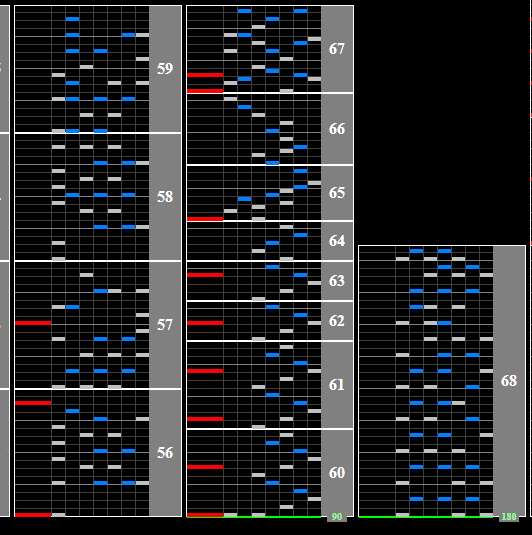

# ZETA～素数の世界と超越者～

Alternative titles: ZETA~sosuu no sekai to chouetsusha~

## Chart Preview
Chart played by DOLCE.

 MAX-14 PERFECT / played by DOLCE. / beatmania IIDX23 copula [手元付き]")

## Read slow

This chart features a slowdown in the middle with no gaps to adjust your hi-speed without breaking combo. If you aim on holding combo, reading slow is advised. 

The non-ran (mirror for 2p) for this chart features an easy section for your right hand and a seperate easy pattern for your left hand to transition into reading slow.

During the slowdown, look out for chords. The chords signal the end of the slowdown.

If you're only looking for normal clear floating is fine. However, even for scoring, reading slow is advised.