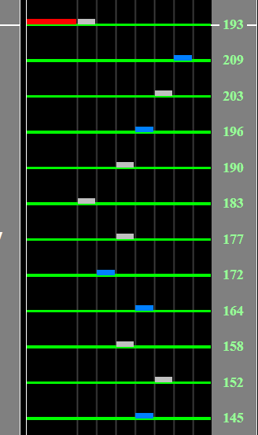

# Session 12 -Esther-

## Chart Preview
Chart played by HyoNi Kim

## Set for 193

All of the soflan for this chart is at the beginning. It slows down, it speeds up and that's it.

Funnily enough, during the speedup this chart actually goes to 209BPM and then back to 193BPM. If you want some sexy perfect Green Number action (because adjusting for max bpm would be adjusting for 209BPM and the rest of the chart is 193BPM), **set your Base GN at the beginning to 192/172 \* GN**. After the speedup, you will be at your normal base GN.

You can probs just gear shift down 1 and be fine if you dont care about exact numbers, no changing Base GN required.