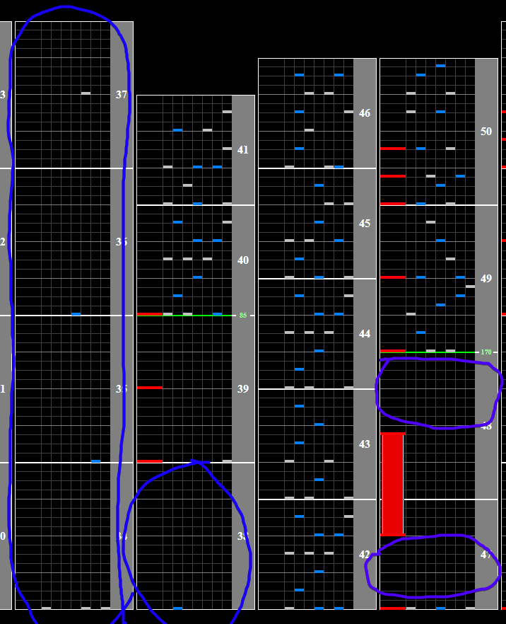

# SA.YO.NA.RA. SUPER STAR

Alternative Titles: Sanoyara SUPER STAR

## Chart Preview

Chart played by gett

")

## ★★☆☆☆ Method 1: Gear shift (optimal)

Adjust your lane cover so that your floating hi-speed is a multiple of 0.5 (0.5x, 1.0x, 1.5x, 2.0x, etc). If you can't do this, the strategy will still work just not with perfect double/half GN numbers.

Right as you are approaching the slow down there is a very low density section where you have a lot of time to adjust your Green Number. You want to gear shift enough times that you **DOUBLE** your floating hi-speed. Gear shifting always affects your hi-speed by 0.5x. So for example, if your hi-speed is 2.0x, you want to shift up 4 times.

After the half bpm section there is another large break. Shift down the same amount of times that you shifted up and bingo you've done it.

Shift up at blue, shift down at purple. Be wary of accidentally floating, as this will destroy your gear shift efforts.

## ★☆☆☆☆ Method 2: No tech.

If you can comfortably read slow there isn't really a reason to go out of your way to tech this one. The slowdown is pretty tame, even for a SPA10.
