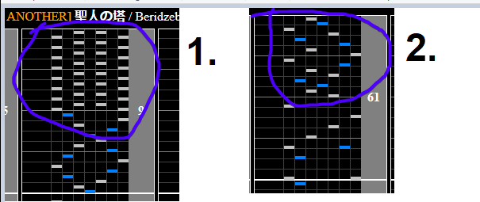

# 聖人の塔

Alternative Titles: Seijin no tou

## Chart Preview
Chart played by IIDXtom

## Set for 194

Set your Base GN so that the minimum GN of the chart is 194BPM and just read it slow. This chart doesn't have any sections where you can easily adjust your Green Number, so if you want to hold combo you're going to have to just read with the flow of the chart.

Note that there are two more slow sections, one of these closing out the chart. The signal for the first 2 slow sections ending is a roll/dense stream, so keep your eyes out for those.

You can probably still scrape a clear by floating if that's all that you're looking for out of this chart.