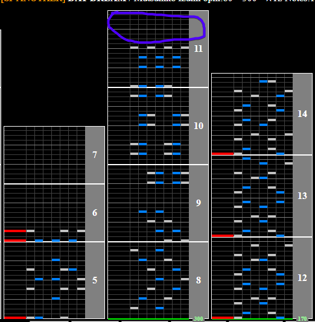
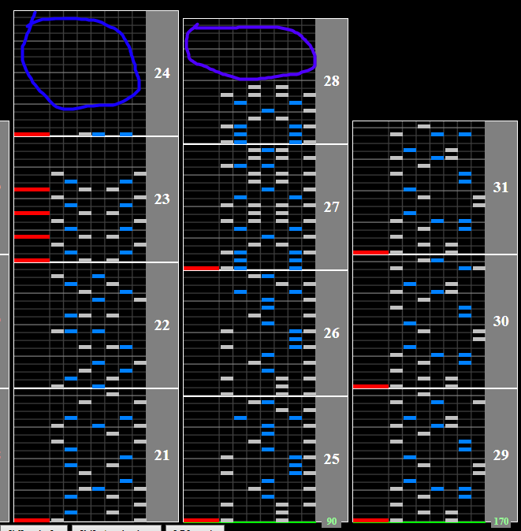

# DAY DREAM

## Chart Preview

Chart played by MAX-KR

## ★★★★★★ Pre-float + lane cover off + Gear Shift

The most complicated tech that can completely remove the need to read slow.

1. Set your Base GN to `0.5667 * current GN` (0.5667 ≈ 170/300)
2. Ensure that your lane cover is in a spot that allows this number. Too low, and the game will force a lower GN. **Optionally, turn off your lane cover**
3. Gear shift to `3.75 * regular GN` (4x is fine)
4. Read the easy part slow
5. Read the difficult section at the beginning at your regular speed
6. Float (or turn on your lane cover) in the gap right before the chart slows down again (circled in purple)

This has you covered for the entire opening section. You can also read the start at a faster speed, but this will require you to do more gear shifting mid chart.

For the middle of the chart there is a 90BPM slowdown section, however there are gaps before and after it for you to fit some gear shifts in.

Try to gear shift up (at blue) enough times that you **double** your hi-speed value, but 2-3 should be enough.

Gear shift down (at purple) by the same amount.

That is all the soflan for the rest of the chart. For NC, try to build some gauge after this section. For HC, if you made it this far and you're good at bursts you should be home free.
