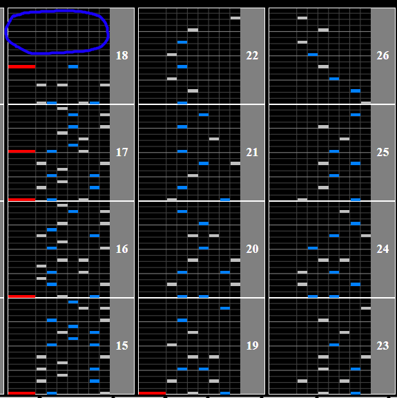
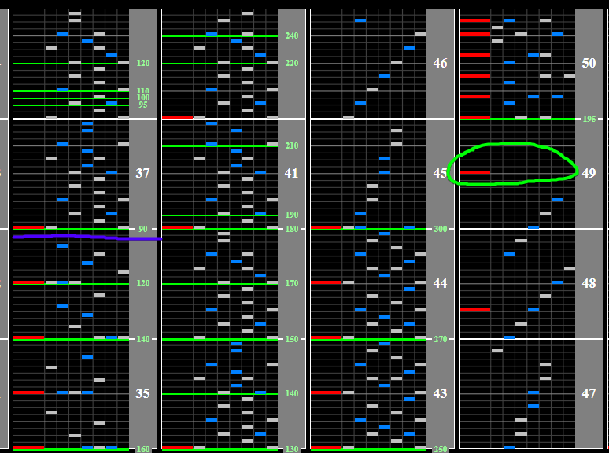

# JOMANDA

Alternative titles: JOMAMA, JO MAMA

## Chart Preview
Chart played by DOLCE.

 MAX-81 (3755) / played by DOLCE. / beatmania IIDX26 Rootage")

## Pre-float + read slow

There's no real way around it. If you want to HC this chart, you'll need to read slow. Otherwise, just float after the speedup and climb to 100% gauge for the NC.

This tech focuses more on the transition between the speedup and the rest of the chart rather than focusing on the speedup. If you can get through the first 10 seconds of the speedup, it becomes easier to read as it speeds up.

1. Set your Base GN to ``0.65 * current GN`` (0.65 = 195/300)
2. Gear shift back to your regular GN
3. Gear shift down 1 or 2 at the end of the slowdown depending on how fast you can read (marked with purple line)
4. Float on the final scratch during the speedup (circled in green)
5. The rest of the chart will be at your regular reading speed

If you're good at reading slow and struggle to fit in gear shifts without breaking combo, you can gear shift in the larger gap before the speedup instead (circled in blue).

