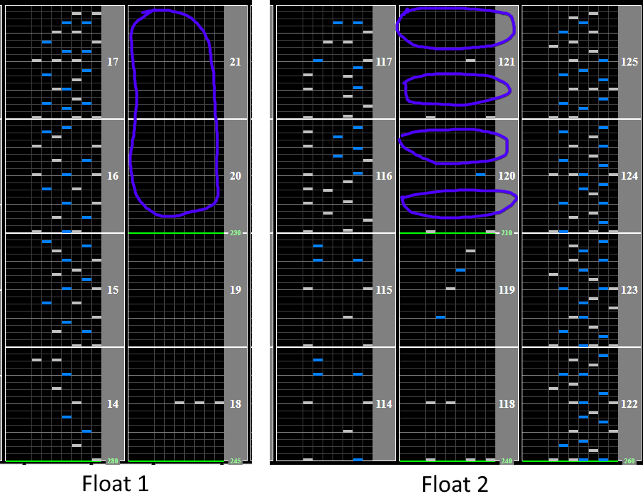
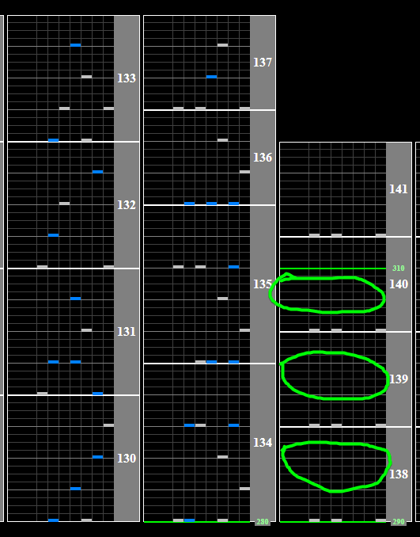

# 音楽

Alternative titles: Ongaku

## Chart Preview

Chart played by RAG OJI

 2874(Max-100 World Record)")

## ★★★☆☆ Method 1: Set for 260 and double float

This chart has 2 major speed changes. The first is a gradual speedup from 230BPM to 280BPM. The second is a speedup from 210BPM to 260BPM.

This second speedup comes before the densest section in the entire chart, so its important that any important speed changes are performed before this section. The key part of this strategy is that the ratio between 280BPM and 230BPM (1.2174) and 260BPM and 210BPM (1.2381) are very close.

1. Set your Base GN to `1.2381 * regular GN` (1.2381 ≈ 260/210)
2. Float at the empty 230BPM section at the start of the chart
3. Read the easy section slow, the chart will speed up back to your normal speed
4. Float anywhere in the 210BPM section before the burst
5. Turn off your lane cover (278WN optimal) or shift down by 1 in any of the gaps after the burst

Almost the entire chart will play at your desired green number. Float spots below (purple), Gear Shift/lane cover off spots (green)

## ★★☆☆☆ Method 2: RAG's Strategy (Single float, read fast)

RAG's strategy is similar to Method 1, however he sets for 260BPM earlier on in the chart eliminating the need for a second float.

1. Set your Base GN to `1.1304 * regular GN` (1.1304 ≈ 260/230)
2. Float at the beginning in the 230BPM section. This will set you up for the speedup at the end
3. Read the middle of the chart fast (~8% faster than normal)
4. Turn off your lane cover (278WN optimal) or shift down by 1 in any of the gaps after the burst (image above)

Simpler than Method 1, almost set and forget besides the ending.
