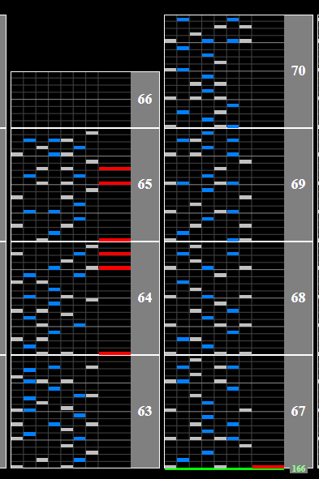

# SYNC-ANTHEM

## Chart Preview
Chart played by HyoNi Kim

## Set for 166, or read fast

SYNC-ANTHEM has a single BPM change from 160BPM to 166BPM towards the end of the chart. This means you have 2 options.

**OPTION 1: Read the ending fast**

As its only a 6BPM increase (3.75% speed increase), you can probably comfortably read the ending that extra bit fast.

**OPTION 2: Set for 166BPM**

If you would rather read most of the chart a tad bit slow and read the ending normally, set the chart so that the minimum GN is your regular GN (or ``1.0375 * GN`` for older styles).

