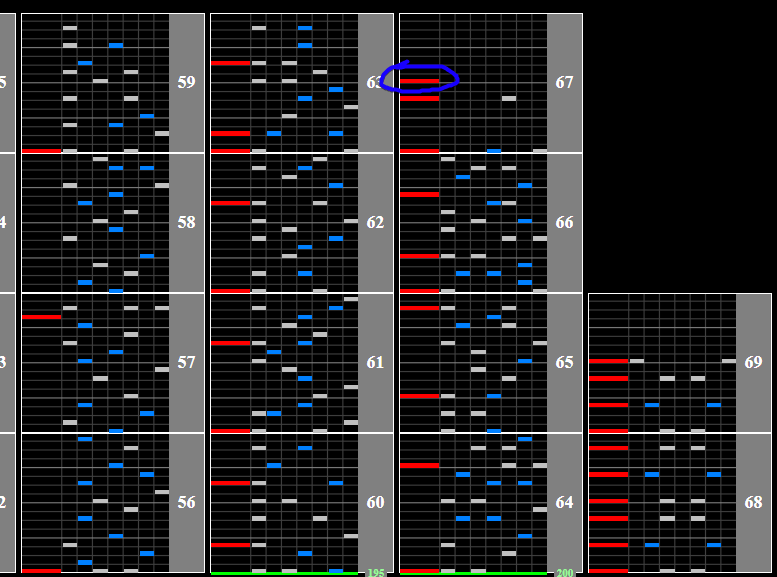

# Sol Cosine Job 2

## Chart Preview

Chart played by IIDXtom

## ★★☆☆☆ Method 1: Float (optimal)

Sol Cosine Job 2 has a calm increase from 190BPM -> 195BPM -> 200BPM. There's a really simple float spot shortly after the final BPM change that fixes your GN back to what it is normally (circled in blue).

You could honestly just no-tech this and be fine, but the float is so easy there's no reason not to do it.

## ★☆☆☆☆ Method 2: Set for 200

If you're too lazy to float, you could adjust the chart so your regular GN is your minimum GN. Honestly though, just float it.
