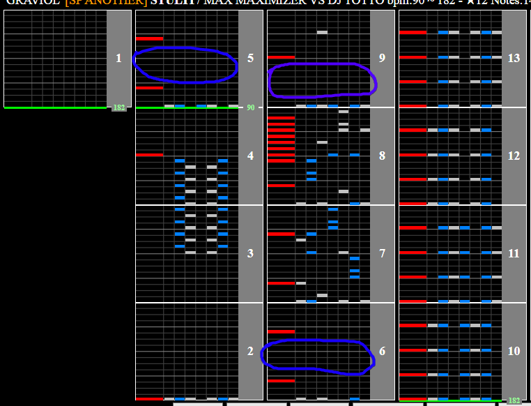

# STULTI

## Chart Preview

Chart played by MACAOJ

## ★★☆☆☆ No tech (Optional Gear Shift)

While the soflan in STULTI isn't too difficult to read slow, you CAN gear shift up as much as you like (2-4 recommended) after the scratches towards the beginning of the soflan (circled in blue).

There is ample space for you to shift back down the same amount before it speeds back up again (circled in purple).

