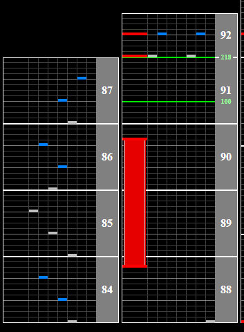

# 朝焼けから始まるボクらの小さな旅

Alternative titles: Asayake kara hajimaru bokura no chiisana tabi

## Chart Preview
Chart played by DOLCE.

 MAX-28 PERFECT / played by DOLCE. / beatmania IIDX23 copula [手元付き]")

## No tech required

This chart slows down to 100BPM after the second backspin scratch and speeds back up to 218BPM on the first note after that gap. As long as you know that this slowdown is in the chart, theres no real way to break combo (or even lose score) on it.

