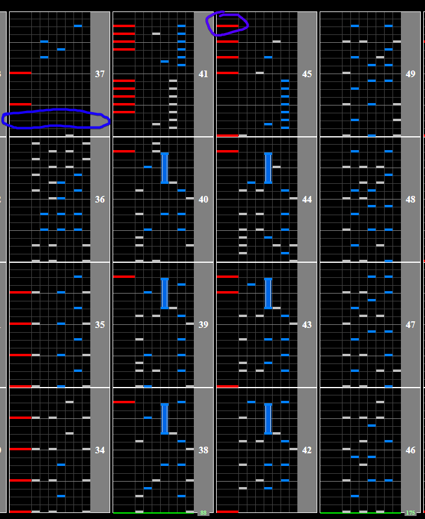

# GET READY!!

## Chart Preview

Chart played by IIDXtom

## ★★☆☆☆ Method 1: No tech

If you aim on holding a full combo, this chart almost requires that you don't use any Soflan tech during the slowdown. This is because the scratch notes are very close to the black keys that you could easily use to Gear Shift. This isn't even factoring in that on random these keys would be even more spread out.

This being said, I'll include a Pre-float method for scoring below.

## ★★☆☆☆ Method 2: Pre-Float

1. Adjust your Base GN to be double what it normally is, and try to get your Hi-speed as close to a multiple of 0.5x as possible (0.5x, 1.0x, 1.5x) by adjusting your lane cover
2. Gear Shift back to your regular GN. If your new Base GN is a perfect multiple of 0.5x, you'll get to keep the same pristine GN you normally play on
3. In the blue circle on the image below, Gear Shift up enough times to double your Hi-speed (or something close to that). If you can't read fast for the 5 notes after this spot, try not to fully double the number
4. The slow section is no longer slow! Read it like normal
5. Float at the purple circled scratch note. This will double your GN again, resulting in the speedup returning you to your normal Base GN

Be wary not to hold start and move the turntable at the same time while you are gear shifting up, as this will float you to a very slow speed.

