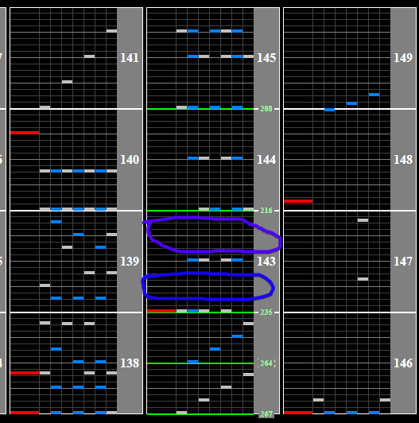

# 明鏡止水

Alternative titles: Meikyoushisui

## Chart Preview
Chart played by IIDXtom

## Read slow (optional gear shift)

This chart has a fairly simple slowdown at the end that is mostly readable even for people who struggle with reading slow until the chords come in. 

There is an optional gear shift up by 1 that you can after the first or second chord (second required if you're worried about accidentally floating) that will make the ending chords more readable. I'll mark these with blue for first gear shift, purple for second.

These are not necessary if you are comfortable with your slow reading, even for scoring.

