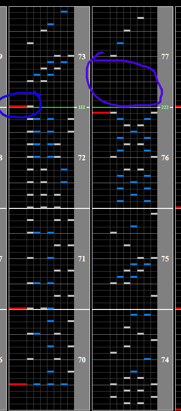

# NINJA IS DEAD IIDX ver.

## Chart Preview

Chart played by IIDXtom

## ★★☆☆☆ Method 1: Double Float

This song actually has 2 really nice gaps for floating the slowdown, although the first one isn't nearly as intuitive.

For the first float, you want to intentionally drag out your scratch (circled in blue) and just tap start while moving it. This will float you back to your Base GN for the slowdown.

Try not to hold start for too long so that you dont shift your WN by too much.

As for after the slowdown, there is just a simple block where you can float back up (circled in purple). No reading slow required.

## ★☆☆☆☆ Method 2: Read slow

The patterns and rhythms during the slowdown aren't terribly difficult. If you're good at reading slow and just playing for the clear by all means you don't have to use any tech for this chart.
