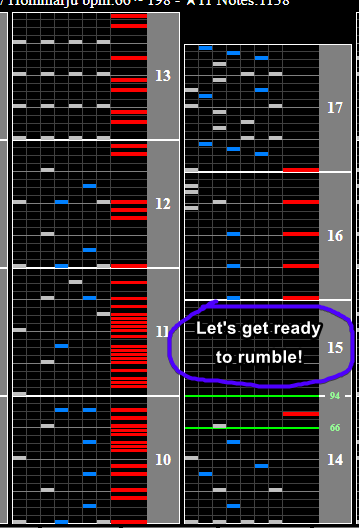
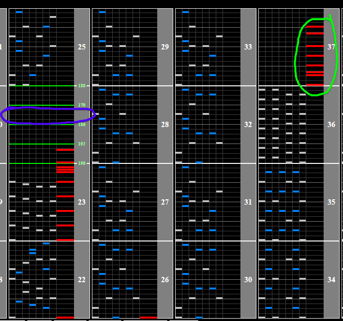
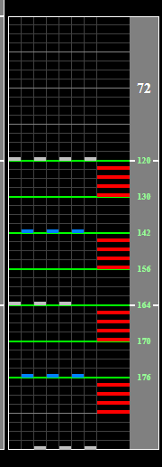

# Beat Juggling Mix

## Chart Preview

Chart played by DOLCE.

 MAX-61 / played by DOLCE. / beatmania IIDX24 SINOBUZ")

## ★☆☆☆☆ First float

Beat Juggling Mix has 2 very serious BPM changes as well as a slowdown at the end that can easily break your combo and tank your score if you're unfamiliar with it.

The first BPM change comes towards the early side of the chart. Just float when you hear the sample "Let's get ready to rumble" or any time after the bar-line preceding this sample (circled in purple).

## ★★★☆☆ Second Float

The second float comes when you hear the turntable spinning out in the song. There are 5 total BPM changes here. Your aim is to float after the third one (186BPM, optimal spot circled in purple).

-  If you are too early, the chart will scroll a bit too slow
-  If you are too late, the chart will scroll a bit too fast

If you happen to miss this float, your run isn't over. Right before the drop there is a solo scratch section (circled in green). You can easily float again during this section to fix your Green Number back to normal.

## Mind the slowdown!

At the very end of the chart there is a slowdown. Just remember that on every half of a beat the chart slows down (ie, at every chord AND every set of 4 scratches it gets a little bit slower).

No tech really needed here, just try to get a feel for the slowdown.

