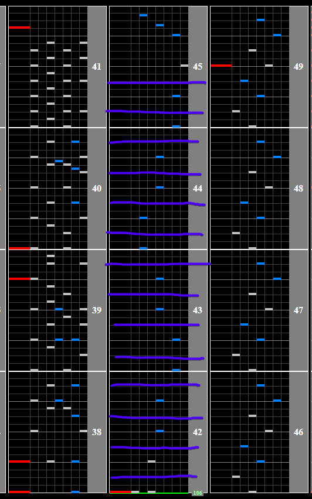

# BREAK OVER

## Chart Preview
Chart played by IIDXtom

## Single float

Unlike its successor [Hella Deep](../iidx25/HD.md), BREAK OVER has an abrupt BPM change, without anywhere to float it for absolutely free. That being said, there are very large gaps where you can easily fit a float in without breaking combo before the song picks back up again (any purple line).

This is the only BPM change in the song.

