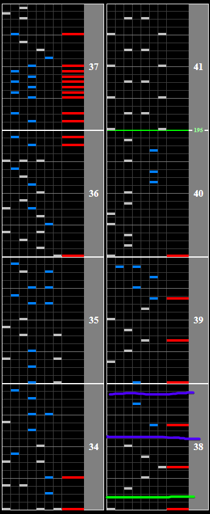

# Sarutobi Champion is 拙者

## Chart Preview
Chart played by IIDXtom

## Method 1: Gear Shift

During the simple section of the chart, you can get away with sneaking in a Gear Shift down by 1 or 2, depending on which is closer to your Base GN and is more comfortable to read. You'll need to read the notes after you gear shift down fairly slowly, but you'll be prepared for the speedup without having to monkey around after.

Easier spots noted with a purple line, hell difficulty spot with a green line.

## Method 2: Lane cover off (simplest)

With a SUDDEN+ lane cover of 333 (lift users can use ``333 * (1000 - Lift) / 1000`` to find the WN for them), you can just turn this off at anytime, and after the slowdown you'll have your pristine Green Number back.

If reading without a lane cover is difficult for you, you may need a higher WN than 333. Experiment and see what you can read.

Optimal lane cover off spots are the same as Method 1.

## Method 3: Pre-floating

Set your Base GN to ``195/130 * current GN``. Gear shift back to your regular GN so that the beginning of the chart is readable (might take some fiddling with WN to get a clean Gear Shift). 

Float at the green line in the image above and read the calm section slowly. This is essentially the same strategy as method 1, but...

1. It guarantees that after the speedup, you'll be at perfect Regular GN
2. You can float easily using the note before the green line
3. **This can be a pain** if you don't understand [Pre-Floating](../../prefloating.md) well enough
4. **This can also be a pain** if you can't find a comfortable gear shift at the beginning

## Method 4: Float

Worst comes to worst, if none of this tech works for you just float the BPM change and tank the score loss. IIDXtom does this in the chart preview and still holds an extra-hard clear, so it's clearly viable.

Float on the 195BPM line shown in Method 1. You'll want to float as soon as the BPM change happens as the change in GN is very severe and hard to read fast.