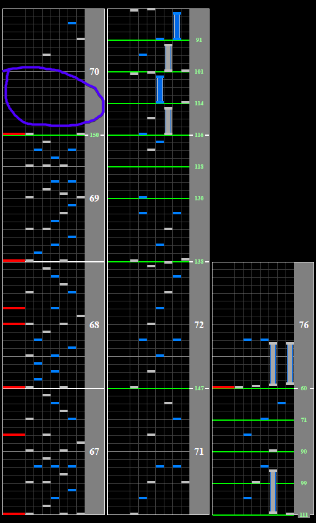

# Surf on the Light

## Chart Preview
Chart played by IIDXtom

## No tech (optional gear shift)

This chart just has a slowdown at the end, meaning no Base GN tech required.

As the chart gradually lowers from 160BPM to 60BPM (less than half speed), if you can read fast for "7ish seconds" a Gear Shift in the purple circle is heavily advised.

Otherwise, reading this ending slow is completely fine.

