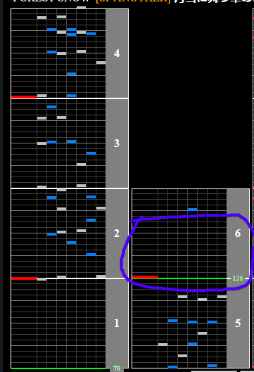

# 月雪に舞う花のように

Alternative titles: Tsukiyuki ni mau hana no youni

## Chart Preview
Chart played by IIDXtom

## Float

This chart has a single BPM change at the beginning from 70BPM to 125BPM with a giant gap for you to float at. Once you see the first lone scratch in the chart, float on or after it for a smooth transition.

This is a really nice chart to float by turning your lane cover off and back on (pressing start 4 times), as this will leave your WN unaffected.

