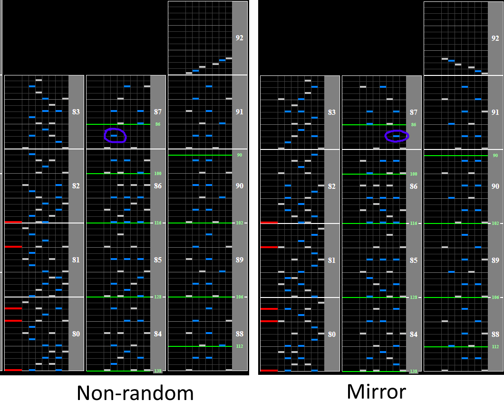

# nostos

## Chart Preview

Chart played by IIDXtom

## ★★☆☆☆ Set for 138BPM or set for 144BPM

This chart has too many BPM changes in awkward places to really do anything about, as well as a gradual slowdown at the end.

For this reason, I would recommend centering your GN around either 138BPM or 144BPM.

-  If you center around 138BPM, you'll need to read most of the chart around 4.3% faster than normal, but the beginning will be less slow
   -  Set Base GN to `138/128 * regular GN` for this strategy
-  If you center around 144BPM, most of the chart will be at your usual scroll speed other than the beginning
   -  Set minimum GN to regular GN, or `use 144/128 * regular GN` for older styles

For both of these strategies the ending will still scroll quite slowly, so reading slow is a must for this song.

## ★★★☆☆ Optional non-ran gear shift

During the ending on non-ran/mirror, there is a guaranteed single black key that is fairly easy to gear shift up on. If you really struggle with reading slow, considering trying this chart on non-ran and Gear Shifting up by holding start and hitting the circled note like normal.

