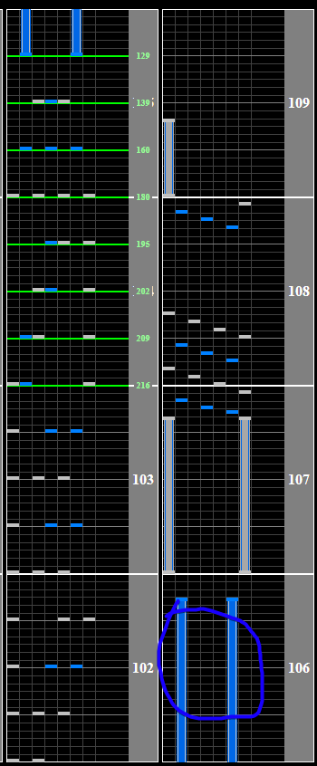

# 2 Player

## Chart Preview
Chart played by DOLCE

 MAX-28 & PERFECT / played by DOLCE. / beatmania IIDX25 CANNON BALLERS [#IIDX​]")

## Method 1: Read slow + float

2 player features a pretty tame slowdown towards the end. While it might take you a couple of attempts to score well on the ending, it is definitely something that you can get a feel for and consistently hit. 

Why should you float? To put it simply, after the CNs there are a couple of short note bursts that you're going to want to be at full Green Number to read.

You can float by turning your lane cover on and then back off during the second last long CNs. DOLCE does this in the chart preview video, so if you're not sure how this method works give the preview a watch.

Float CN circled in image.

## Method 2: No tech (lazy)

You can honestly just read the whole ending slow and mash it a bit and you will probably still clear.