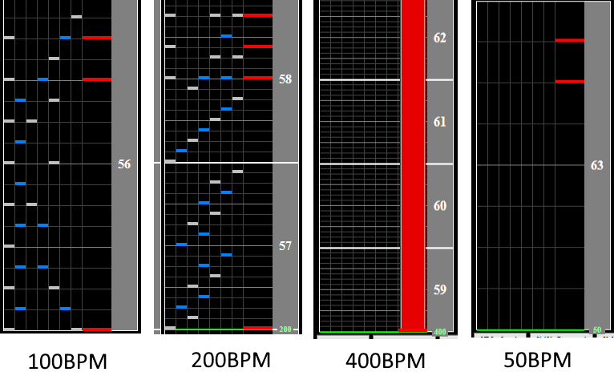

# DropZ-Line-

## Chart Preview

Chart played by DOLCE.

 MAX-51 & FC / played by DOLCE. / beatmania IIDX25 CANNON BALLERS #IIDX")

## ★★★★☆ Read Slow + Memorise

DropZ-Line- dropz from 200BPM to 100BPM, back to 200BPM briefly, to 400BPM briefly, to 50BPM briefly then back to 200BPM for the chorus and subsequently the rest of the chart.

The key thing to note here is that the 200BPM chunk, 400BPM chunk, 100BPM chunk and 50BPM chunk are all the same length in the song, so with some practice you can get a feel for the BPM increases. Take a note from [1:16](https://youtu.be/ekb0pYPz_lc?t=76) in the preview video.

1. Read the initial 100BPM section slow
2. Recognise that the 200BPM section is just a stream
3. Memorise that the 400BPM section is just a single backspin note, but ** the length of the backspin is the same as the length of the 200BPM section!**
4. Memorise that the final 50BPM section is just 2 scratch notes, and that the chart speeds back up to 200BPM afterwards!

This is an image of all of the sections stretched to show the patterns if they all ran at 200BPM. You can see how they change with the BPM changes.

