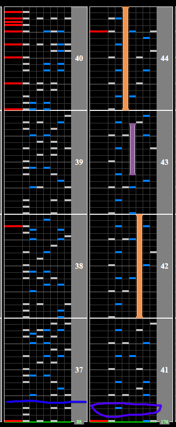

# EMERALDAS

## Chart Preview

Chart played by IIDX MK.

Both methods are viable in different situations.

## ★★★☆☆ Method 1: No tech

Especially for clearing (HC, EXHC), being able to read the Soflan in this chart well saves you the gauge you would lose from floating after it. As with other half BPM semi-forced soflan, if you're struggling to read it the non-ran might help. Otherwise, putting some practice into reading slow will go a long with with this chart.

## ★☆☆☆☆ Method 2: Floating

Floating EMERALDAS is actually a good technique for scoring depending on how well you can read slow, so I'll list good float spots here. Try to avoid floating when there are large amounts of notes to minimise score loss. (float at blue to speedup, float at purple (miss the note) to slowdown)

