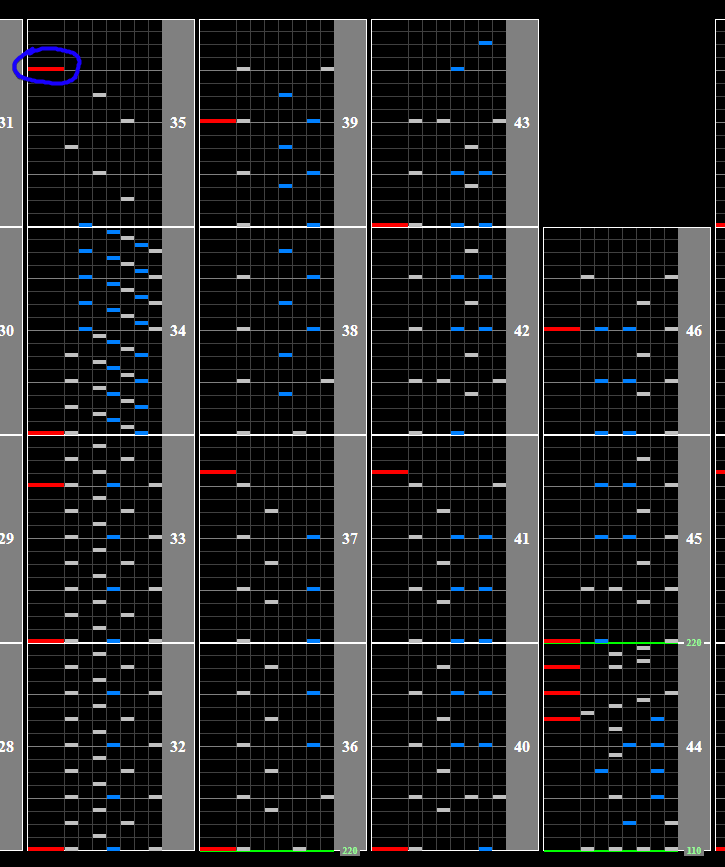
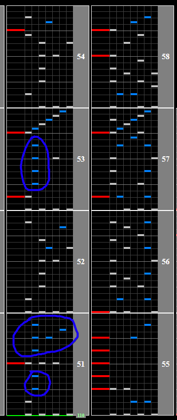
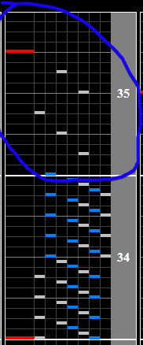
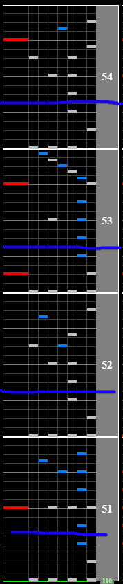

# FUTURE is Dead

## Chart Preview
Chart played by DOLCE.

 MAX-54 & FC / played by DOLCE. / beatmania IIDX25 CANNON BALLERS")

## Method 1: Pre-Float + Gear Shift (optional)

Method 1 is more of a set and forget, and as so requires reading slow. If you want a more active method that doesn't require reading slow at the end of the chart, check out Method 2.

To [pre-float](../../prefloating.md) this chart, 

1. Set your Base GN to double what it usually is and gear shift back to your regular GN. This allows you to store the GN for the drop and float before the song speeds up
2. Float at the final lone scratch before the BPM increases
3. Take note of the slowdown in the middle of the 220BPM section, as it's quite brief and speeds back up

After you get through the 220BPM section the chart will be back to 110BPM. Remember that because your Base GN is doubled, **floating will not fix your scroll speed**. Instead, you can either read it slow or look for notes to gear shift on. On mirror (picture below) there are a lot of stray notes on 2, but this chart is definitely manageable on most randoms. You can hold start as you hit these black keys to shift up so that the stream at the end is readable. You want to gear shift up by about **3 or 4**.

## Method 2: DOLCE. (lane cover off + gear shift)

This method is more active than Method 1 and will require a bit more fiddling with lane covers and what not, but allows you to easily switch your lane cover back on at the end for a nice float.

Before the initial speedup, there is a section where the density almost comes to a halt giving you time to work out some gear shifting and turn off your lane cover.

You're aiming for the result of turning off your lane cover and gear shifting by about 3 or 4 to be your GN being DOUBLED. You can experiment by gear shifting while holding start before the song starts and seeing how your Green Number changes. Aim to get within 15 of your regular Green Number.

After playing the 220BPM section, look for a comfortable spot to float. If you turned your lane cover off, remember that turning it back on will automatically float. Recommended spots marked with a blue line.

## Method 3: Remove lane cover only

While I personally don't use this because reading 500WN is uncomfortable for me, this might be helpful.

1. Set your SUDDEN+ lane cover to half way down the lane (500WN if you don't use lift)
2. Double tap start to turn off your lane cover before the drop
3. Read the drop with 0 lane cover
4. Double tap start to turn it back on after the drop

The float spots shown in the image above are good places to turn your lane cover back on after the final slowdown.