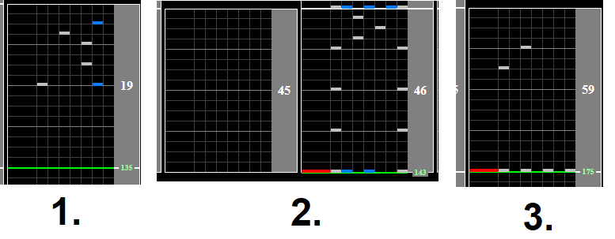

# 50th Memorial Songs -Flagship medley-

## Chart Preview

Chart played by LUMINE

## ★★★★☆ 2 Floats and some speed

This chart starts at 175BPM, drops to 135BPM, jumps to 143BPM and then back to 175BPM.

The beginning BPM change is extremely floatable, the middle one not so much. While there is a gap to do a gear shift, its only an 8BPM difference and you can get away with just reading it a bit fast. The final BPM change is also very floatable, so just noting down where the song changes BPM and floating the beginning and end changes should net you a free score.

