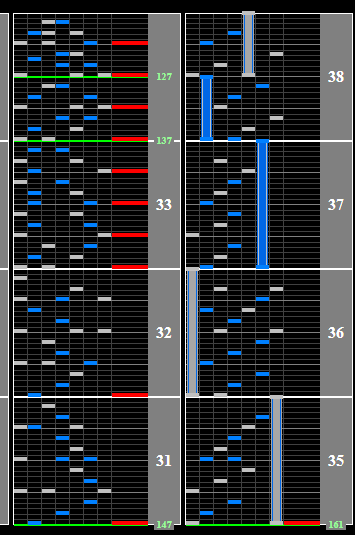

# EVANESCENT

## Chart Preview
Chart played by LUMINE

## Set for 165 (optional) + reading slow

While the second half of the chart is at 165BPM, the chart starts at 161BPM. If this slight increase bothers you, you can adjust your Base GN to ``165/161 * current GN``. Do note that this will make the slow section a little bit slower.

This chart has a light slowdown but quickly returns to 161BPM, and then raises to 165BPM. If the patterns are too abstract to hit, they are definitely easier on non-ran. The short slow reading section isn't really worth floating over, nor does the chart give you any good sections to gear shift, so no-tech is fine for this chart.

You can see just how short the soflan section is on the image below, and also in the chart preview.

