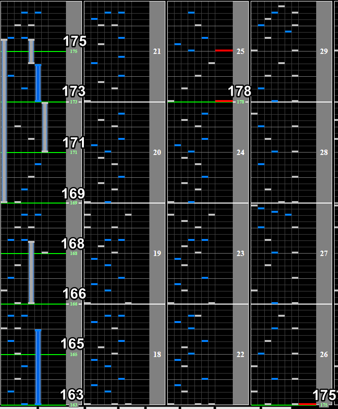

# Particle Arts

## Chart Preview
Chart played by DOLCE.

 全国トップ / played by DOLCE. / beatmania IIDX26 Rootage")

## Set for 175

Particle Arts starts at 165BPM and gradually increases to 178BPM, then back down to 175BPM. Set your Base GN to ``175/162 * Current GN`` and just read the start slow. The speedup section is too dense to easily do Soflan stuff there.

[