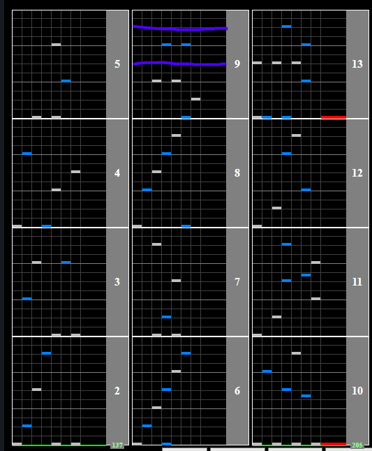

# The Sealer ～ア・ミリアとミリアの民～

## Chart Preview
Chart played by SILON

## Method 1: Read slow

This chart starts at 137BPM for a really easy section, and then jumps up to 205BPM for the rest of the chart. While there is a small gap for you to gear shift, no-teching this is much easier due to the lack of density.

You can also easily restart the song on FREE credit modes as the slow section is at the beginning, so you can keep trying until you hit the slow reading section.

## Method 2: Pre-float

If you absolutely CAN NOT read slow to save your family held at gun point, heres an overkill strat you can try out.

1. Set your Base GN to ``205/137 * current GN``, or set the chart so that the minimum GN is your regular GN (these will be the same value).   
2. Gear shift back to your regular GN so that you keep that value stored.   
3. Float back to your new Base GN during either of the purple lines.

If this technique doesn't make sense to you, check out [Advanced - Pre-Floating](../../prefloating.md) for a full page on it.

