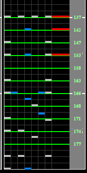

# ToyCube pf.(RX-Ver.S.P.L.)

## Chart Preview
Chart played by 도부 (?????)

 (SPA 9)")

## No tech required

This chart has consistent BPM up until the very end, where it slows down while you're hitting the notes similar to opal of ruins. I wouldn't really recommend any tech for this chart, just take note of the slow down and be ready to take the ending a bit slower.

