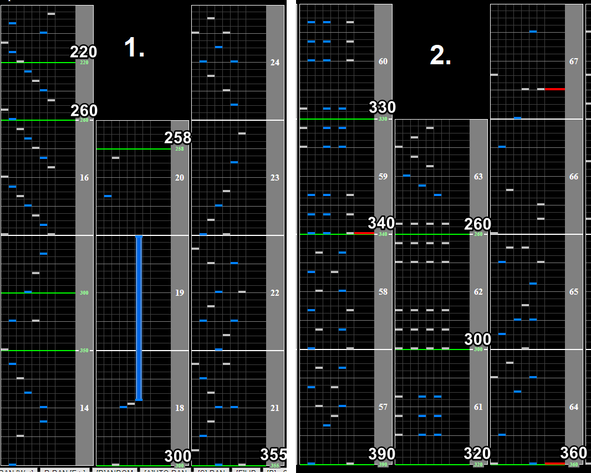
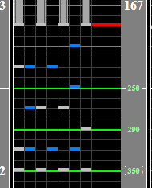

# ruin of opals

## Chart Preview
Chart played by LUMINE

## Put up your GN a bit

Although ruin of opals has some wacky soflan at the beginning and end, the majority of the chart is at 360BPM, and the chart starts at 355BPM. A perfect Base GN adjustment would be ``360/355 * your regular GN``, but I personally just shift it up by about 5.

The speedup to 390BPM is quite short and extremely manageable (even moreso if you shift your GN up a bit).

Watch out for the slowdowns during the streams at the start, as well as the abrupt speedup. In the second slowdown following this, once you see the chords thats the signal to slow down. Once the chords stop, you'll be at 360BPM for almost the rest of the chart.

As for the ending, its similar to the second slowdown. Once you see chords, you know that the chart is about to slow down. Watch out for the notes during the CNs, and this chart is pretty chill with no active tech required. All in the reading.

