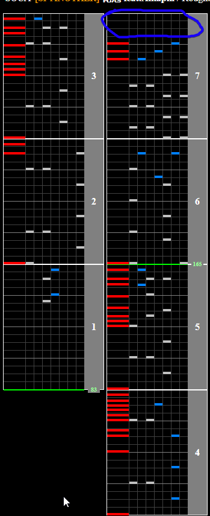
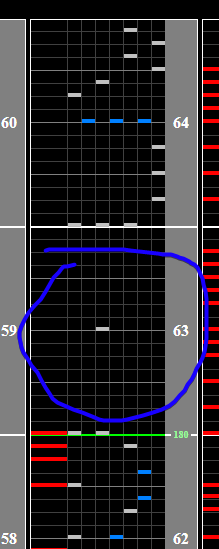

# 花冠 feat.Aikapin

Alternative Titles: Hanakanmuri feat.Aikapin

## Chart Preview
Chart played by DOLCE.

 ちょい解説付き / played by DOLCE. / beatmania IIDX26 Rootage")

## Gear Shift at start + Float at end

Hanakanmuri starts at 83BPM before jumping to 165BPM quite abruptly. For this reason, I recommend gear shifting down by 3 or 4 (whichever is more readable after the speedup) and then floating later by scratching an extra time to get your GN back to what it should be. (circled in blue)

The reason you should use gear shifting at the beginning instead of changing your Base GN is to preserve it for the ending where you'll need to float. The float at the end is trivial, as the chart gives you a huge window to float. Look for the gap and float it.

If you're unable to read the start slow, instead of gear shifting just float at the start.