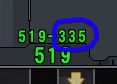

# シャムシールの舞

Alternative Titles: Shamshir no mai

## Chart Preview
Chart played by IIDXtom

## Method 1: Adjust scroll speed for max

The song starts at 100BPM, abruptly jumps to 155BPM near the start and then gradually decreases back to 134BPM at the end. It's recommended to adjust your Base GN so that the max speed of the chart is when it is at 155BPM and just leave it (adjust the GN so that the number circled is your Base GN). This is effectively like no-tech, so make sure your slow reading is up to scratch!

