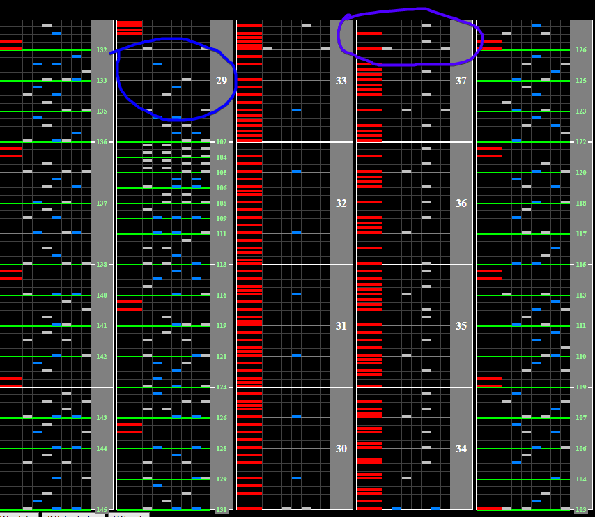

# Theory

## Chart Preview
Chart played by drchoko. Best 11 in the game don't @ me

")

## Click track

## Method 1: Float + Lane cover off (optimal)
Play with lane cover at about 301 (+- 100 is fine). Float at blue so that the scratch section is at correct speed, turn off lane cover at purple so that the speedup isn't too fast and turn lane cover back on at pink to refloat for a nice ending. This method is by far the most difficult but most rewarding.

## Method 2: No tech

If you can read scratch decently well and read slow decently well you can get away with no-teching Theory. If you're less comfortable with reading slow, try non-ran or mirror. This will give you a comfortable 13  57 roll every time. 

While a **click track** (listed above) helps with all methods, it helps the most with no tech because of the 24th and 32nd scratch patterns weaved in with the rest of the 16ths. These can be tricky to read at low scroll.

## Method 3: Gear shift

Gear shift up by 2 at the blue circle and down by 2 at the purple circle. Don't be afraid to miss notes to hit the gear shift accurately. You'll make it up with your accuracy during the scratch section.

## Method 4: Recurring Float

Less serious version of method 1.

Set your lane cover as high as it goes (41wn) but **leave it on**. Float at the blue circle and at least every 2 purple circles with the last purple circle being a mandatory float. allows you to almost always have the chart at a speed you like but requires way more effort than other methods.

Easier to pull off on mirror.

