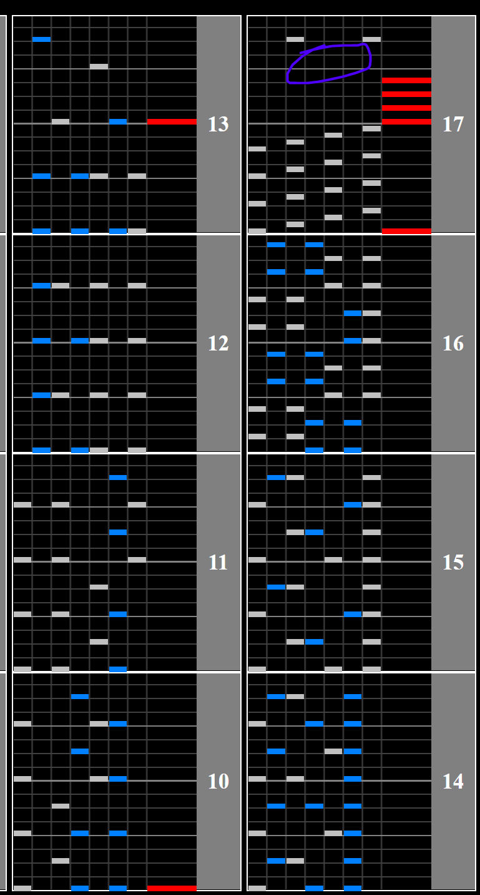

# Ah Hah Yeah

## Chart Preview

Chart played by DOLCE.

 MAX-41 ＆ PERFECT / played by DOLCE. / beatmania IIDX28 BISTROVER")

## ★★☆☆☆ Lane cover halfway (LIFT Substitute optional)

As Ah Hah Yeah just goes from 115BPM -> 230BPM -> 115BPM -> 230BPM, you can put a lane cover halfway down your playfield, disable it for the speedup and just do that again.

1. (optional) Combine your regular LIFT and SUDDEN+ into just a LIFT (see [LIFT Substitution](../../tech\LIFTSub.md))
2. Use regular hi-speed (NOT FLOATING!)
3. Put your SUDDEN+ halfway between the top of the playfield and your LIFT
4. Disable it before the first speedup
5. Re-enable it after the speedup ends

Repeat steps 3 and 4 for the second speedup as it is identical.

You may need to adjust your LIFT a small amount if you want your GN to be perfect.

Good spots to disable lane cover are circled. If you're unsure of where to switch your lane cover on and off, DOLCE actually uses this method without a LIFT substition in the preview video.

## ★★★★★ Pre-Float

This is similar to method 1, however is more difficult and requires more setup.

1. Set your GN to double what it normally is
2. Move your SUDDEN+ around so that your hi-speed multiplier is (or is close to) a multiple of 0.5x
3. Gear shift so that you double your hi-speed multiplier and are back at your normal GN
4. Read the start of the chart normally
5. Float on the scratch before the gap (under the purple circle in the image above)
6. Gear shift back up the same amount after the speedup
7. Float again on the last drop

This is a lot more in depth, but can be helpful for people who dont like reading in tight playfields.
