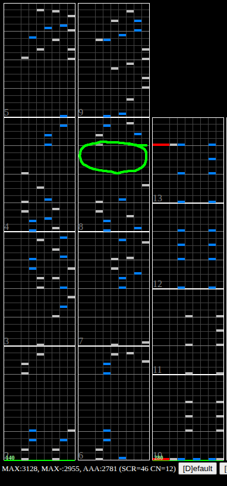

# hora de verdad

## Chart Preview

Played by IIDX toherosu

## ★☆☆☆☆ Prefloat

The only speed change in the chart is just after the intro.

Increase your GN and adjust your lane cover such that you can gear shift up until reaching your usual GN for the slow intro part.

Float at the empty section indicated and read the last few notes slower before the BPM change and you should enter the rest of the chart at normal speed.

