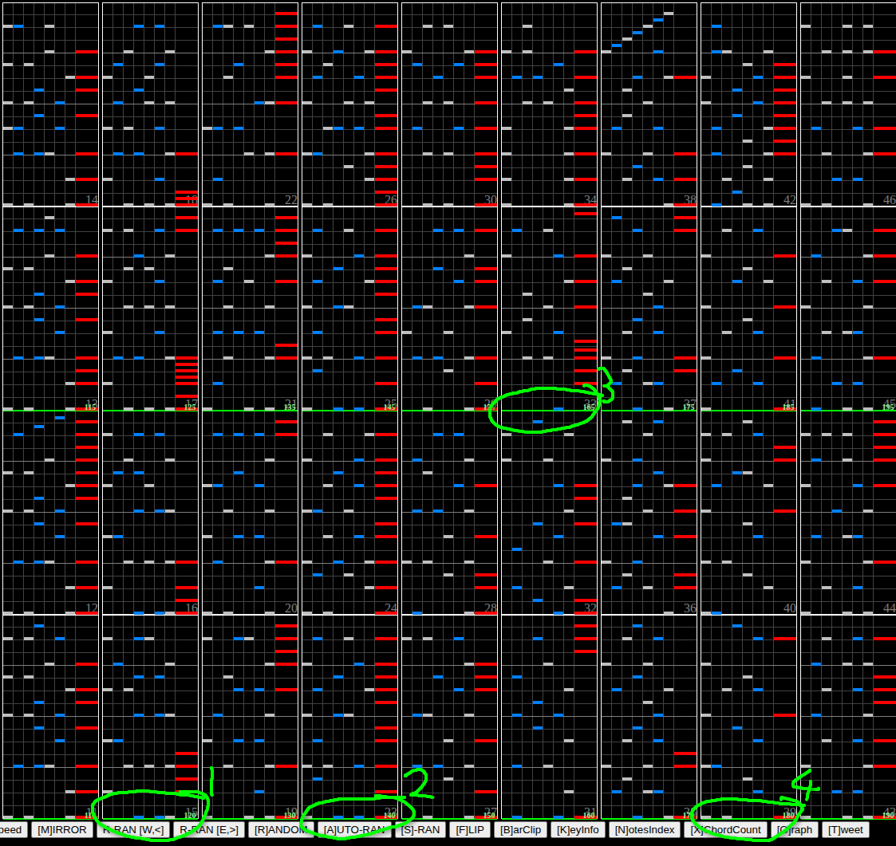

# Skratch Education Lv-1

Ladies and gentlemen, are you ready for the scratch?

## Chart preview

Played by KKM\*

 PERFECT")

Clap track

 譜面確認/皿ハンドクラップ+交互に色分け [仮]")

[Textage](https://textage.cc/score/32/skedulv1.html?2AC50)

## ★★★☆☆ Set GN + floating

Since the BPM increases gradually from 100 to 200 BPM, adjust floating hi-speed by **multiplying your usual green number by 10/9 (about x1.11)** and setting it, then **gear shift up by 1** before the song starts. This should put you roughly near your normal scroll speed.

Tip: When playing on random, the opening note becomes the main axis for jacks during the long scratch later in the song, so you can use this to decide whether to restart or not.

Another tip: On P1, mirror also works well.

### When to float

The key moments to float at using this method are immediately as the BPM changes to 120, 140, 165, and 180. See the below table for guidance on when to float.

| BPM | Timestamp                                  | Measure | Notes                                                                                                                       |
| --- | ------------------------------------------ | ------- | --------------------------------------------------------------------------------------------------------------------------- |
| 120 | [0:35](https://youtu.be/soZg_nfAk9Y?t=35)  | 15      | At the start of the scratches before the "That's it" vocal sample                                                         |
| 140 | [0:52](https://youtu.be/soZg_nfAk9Y?t=52)  | 22      | Roughly halfway through the build-up before the 灼熱Beachside Bunny section                                                 |
| 165 | [1:07](https://youtu.be/soZg_nfAk9Y?t=107) | 31      | Just before the end of the 灼熱Beachside Bunny section                                                                      |
| 180 | [1:15](https://youtu.be/soZg_nfAk9Y?t=115) | 39      | This part is towards the end of the section that sounds like Red by Full Metal Jacket, just as it sounds like the intro again |

After the fourth float, you should be at around your normal green number by the time the song reaches 200BPM. Then it's time to lock in and hit the scratches.
