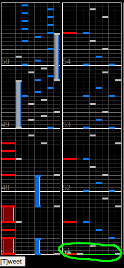

# Space in Time

## Chart Preview

Played by IIDX toherosu

## ★☆☆☆☆ Method 1: Prefloat

Set your GN higher such that the fastest part matches your usual GN, then gear shift down by 1.

Float at measure 51, on the same notes + scratch where the BPM changes to 166.

## ★☆☆☆☆ Method 2: Adjust GN

Just set your GN so that the fastest part matches your usual GN and read the first half of the chart slow.

## ★★☆☆☆ Method 3: No technique

Read the last part of the chart faster without any adjustments.
