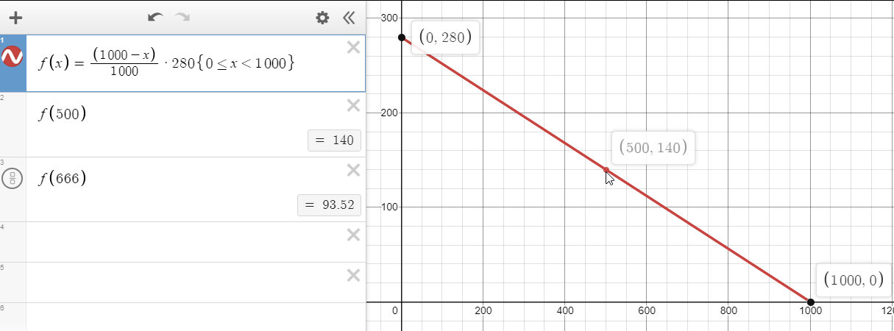

# Lift and Lane Cover formulae

## What is Lift?

Lift is an option that can be (but doesn't have to be) used in conjunction with SUDDEN+. It allows you to raise the judgement line from the bottom of the screen and also uses a White Number. Similar to SUDDEN+, your lift White Number has a max of 1000.

Your Lift height can be changed by holding start and moving your turntable with your SUDDEN+ cover off (double tap start to enable). If your SUDDEN+ lane cover is enabled, this will move that instead.

While using Floating Hi-speed, although Lift will affect exact ratios used to formulate White Numbers, your SUDDEN+ lane cover will function the same way. The most notable similarity is that with Lift off, trying to float with your lane cover off will destroy your Base GN. Similarly, altering your Lift height will destroy your Base GN.

**Advantages of Lift:**

- Allows you to effectively change the size of the playfield
- Can make strategies where the lane cover is turned off more readable due to the smaller lane
- Helpful so that you don't have to powerstance as hard at the arcade

**Disadvantages of Lift:**

- Complicates exact values that are used for calculating soflan strategies
- You may need to disable Lift for charts that have extreme soflan to read them

## Converting for lift players

Any White Number given in this guide is given assuming that you are using 0 lift. If you are using Lift, you can convert the White Number in the guide to the White Number for your lift amount by multiplying it by   
``(1000 - Lift) / 1000``

Details about this formula are listed below.

## Disabling lane cover general formula

If you want to turn off your lane cover to perfectly accomodate for a speedup, find out the old BPM, new BPM and use this formula.

``WN = (1000 - Lift) * (1 - OLDBPM / NEWBPM)``

Details for this formula are also listed below.

## Lane Cover Formulae

What exactly happens to your GN when your lane cover is disabled/enabled? Is there a formula for this that we could use find exact values to set our WN to?

Let's cover this first with Lift disabled (0 WN) for simplicity.

The total length of the lane is 1000 units. This is why your SUDDEN+ and Lift lane covers have a max range of 1000.

**How does Green Number change when disabling SUDDEN+ ?**

The way your Green Number changes when disabling the lane cover is modelled by:   
``New GN = 1000 / (1000 - WN) * current GN``.

- If your WN was 500 (halfway down), turning it off would double your reaction time.   
From the formula, 1000 / (1000 - 500) = 1000/500 = 2 * GN. This checks out.

- If your WN was 666 (2/3 down), turning it off would triple your reaction time.   
From the formula, 1000 / (1000 - 666) ≈ 3 * GN. This checks out.

Think of this as the ratio between the lane cover (WN) and maximum value of the lane cover (1000).

This is best illustrated by this graph of how the formula affects 280GN. You can see how the function is bound between [0, 1000).

The X-value of each coordinate is your WN and the y-value is your new Green Number. As your lane cover approaches 1000, your new GN approaches infinity. (At 1000 WN, the lane is completely invisible, so this makes sense).

**Enabling SUDDEN+ on Regular Hi-speed**

The way your Green Number changes when enabling the lane cover is modelled by   
``New GN = (1000 - WN) / 1000  * current GN``   
This formula is effectively the inverse change of the formula for disabling the lane cover.

- If your WN was 500 (halfway down), turning this lane cover on would halve your reaction time, halving your GN. From the formula, (1000 - 500) / 1000 * GN = 1/2 * GN. This checks out.
- If your WN was 666 (2/3 down), turning it on would cut your reaction time to a third, and in turn cut your GN to a third. From the formula, (1000 - 666) * GN ≈ 1/3 * GN. This checks out.

The reverse function is linear, and you can clearly see from this graph how your GN is bound between your current GN, for example 280GN, and 0 (it can only get faster).

The X-value of each coordinate is your WN and the y-value is your new Green Number. As your lane cover approaches 1000, your new GN approaches 0. (At 1000 WN, the lane is completely invisible, which means you'd have 0ms reaction time, and subsequently 0GN).

**Enabling SUDDEN+ on floating Hi-speed**

On Floating Hi-speed, enabling the lane cover will float back to your Base GN, so the formula isn't usable here.

**Lane Cover Formulae differences for Lift**

As lift changes the length of the playfield, how would the Lift value affect the formula?

Well, the original formula is bound from [0, 1000). What we want is to bind between [0, 1000 - Lift), as the new size of the playfield is given by 1000 - Lift. 

For example, if you had a lift of 200, instead of having 1000 units of space you would have 1000 - 200 = 800, meaning your new formulae would be ``New GN = 800 / (800 - WN) * current GN`` for disabling SUDDEN+ and ``New GN = (800 - WN) / 800  * current GN`` for enabling SUDDEN+.

More generally, the formulae for any lift amount (including 0 for lift off) are:

- Disabling SUDDEN+ : ``New GN = (1000 - Lift) / (1000 - Lift - WN) * current GN``
- Enabling SUDDEN+ : ``New GN = (1000 - Lift - WN) / (1000 - Lift) * current GN``

## Finding optimal SUDDEN+ White Numbers for disabling SUDDEN+

If you've seen [Method 1 for Theory](chartdirectory\iidx27\Theory.md#method-1-float-lane-cover-off-optimal), you may be wondering how I came to the White Number 306 for the SUDDEN+ value.

Let's obtain this number from scratch.

Theory speeds up from 102BPM to 146BPM, and we want to find a SUDDEN+ cover such that turning it off will give us our Base GN. This means that we want our lane cover ratio for disabling the lane cover to be equal to the ratio between these 2 BPM values.

To be more explicit, we want ``(1000 - Lift) / (1000 - Lift - WN) = 147/102``

This can be rearranged to give ``WN = (1000 - Lift) * (1 - 102/147)``

If we plug in my lift value of 0, we get a final result of 1000 * (45/147) = 306.12   
Round this number to 306 for your lane cover and that's your ideal lane cover for this situation.