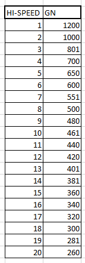

# Regular Hi-speed

Regular Hi-speed in **Heroic Verse** ranges from **1-20 set speeds** (displayed in a table below).   
Regular Hi-speed in **Rootage** ranges from **1-10 set speeds.**

Previous IIDX versions use a multiplier in combination with the songs BPM to give you your Green Number.   
This is referred to as Classic Hi-speed.

From Rootage onwards, similar to floating Hi-speed, regular Hi-speed is also consistent between songs. It doesn't matter if your chart is 140BPM or 300BPM, your Green Number will start at whatever value is shown in the table associated with your game.

## Changing speed (Gear Shifting)

Gear shifting works completely differently for regular Hi-speed as opposed to floating Hi-speed. While floating Hi-speed always changes your Hi-speed by 0.5x, gear shifting for regular Hi-speed just changes your Hi-speed between speeds 1-20 on the table.

This means that

- Regular Hi-speed does not have a Base GN, only a current speed
- Strategies that gear shift but require retaining a Base GN will need workarounds

Gear shifting in Regular Hi-speed tends to change your Green Number by a smaller amount than it would using Floating Hi-speed, making it useful for charts where the BPM change is relatively small (less than 35BPM difference)

While it may seem like the lack of a Base GN limits you (and in a lot of cases it does), there are still techniques that you can accomplish with Regular Hi-speed

## Floating

Although regular Hi-speed doesn't use decimal Hi-speeds, it does have its own version of [floating](float_hs.md#floating). Rather than the player having a Base GN that they can always fall back on by floating, each step from 1-20 in regular Hi-speed has its OWN Base GN. Think of it like this.

- Speed 18 has a Green Number of 300
- Speed 19 has a Green Number of 281

Suppose you are playing on Speed 18 and the song's BPM changes setting you to 100GN (very fast and completely unreadable). Gear shifting up to speed 19 would overwrite this change, setting your Green Number to 281.

Combine this initial speed change with a speed change back to 18, and you've effectively achieved a float using regular Hi-speed.

**WHEN TO USE "FLOATING":**

- When you can safely float without breaking combo
- When you forget the chart has soflan in it (just float to reset)
- You can **not** use regular Hi-speed for [Pre-floating](prefloating.md). If you value this niche technique, you'll need to use [Floating Hi-speed](float_hs.md) instead.

## Toggling the SUDDEN+ Lane Cover

Switching the lane cover off functions identically to how it does for Floating Hi-speed. It sets your Green Number to ``1000/(1000-x) * current GN``.

However, switching the lane cover back on in Regular Hi-speed mode **does not aumatically float**. This could be good depending on if you want it, but can be a dealbreaker for charts that greatly benefit from automatically floating.

Example charts: [Marie Antoinette](chartdirectory/iidx16/MA.md), [FUTURE is Dead](chartdirectory/iidx25/FiD.md) (Method 2), [Y&Co. is dead or alive](chartdirectory/iidx16/YCo.md)

**WHEN TO DISABLE LANE COVER:**

- When the song speeds up without an avenue to float easily, turn off lane cover before
- When you're about to enter a dense speedup
- When the BPM returns to the same value after the soflan section (you can not float by turning the lane cover back on like you can with Floating Hi-speed)

